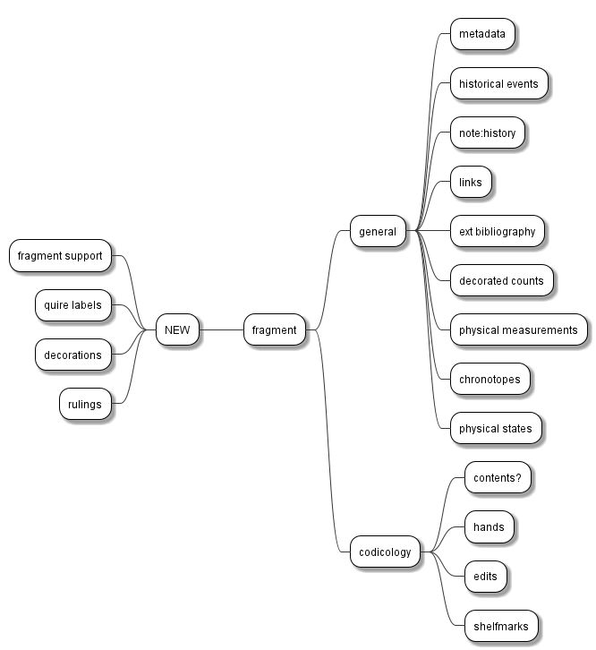

# Cadmus NDP FRAC

- [Cadmus models reference](https://myrmex.github.io/overview/cadmus/dev/models/)

In what follows:

- 📖 marks a [codicology](https://github.com/vedph/cadmus-doc/blob/master/docs/models/index.md#codicology) part.
- ⭐ marks a new part. The star is used once, even when that part is then reused in other items. If a part marked with a star has a link to documentation, this means that I have already implemented it as I could do this in advance for generic parts. All the other parts are still to be implemented.
- ⚠️ marks an area where the model must still be defined with a discussion.

This diagram summarizes the parts planned for this project, grouped by their package:

## Item - Fragment

This item represents a single fragment.

- [metadata part](https://github.com/vedph/cadmus-general/blob/master/docs/metadata.md)
- 📖 [codicology shelfmarks part](https://github.com/vedph/cadmus-codicology/blob/master/docs/cod-shelfmarks.md)
- [chronotopes part](https://github.com/vedph/cadmus-general/blob/master/docs/chronotopes.md)
- [historical events part](https://github.com/vedph/cadmus-general/blob/master/docs/historical-events.md)
- [note part](https://github.com/vedph/cadmus-general/blob/master/docs/note.md) (history)

- [links part](https://github.com/vedph/cadmus-general/blob/master/docs/fr.pin-links.md): used to link the fragment to its container item.
- [external bibliography part](https://github.com/vedph/cadmus-general/blob/master/docs/ext-bibliography.md)

- 📖 [codicology contents part](https://github.com/vedph/cadmus-codicology/blob/master/docs/cod-contents.md)? ⚠️
- 📖 [codicology hands part](https://github.com/vedph/cadmus-codicology/blob/master/docs/cod-hands.md)
- 📖 [codicology edits part](https://github.com/vedph/cadmus-codicology/blob/master/docs/cod-edits.md)
- ⭐ [decorated counts part](https://github.com/vedph/cadmus-general/blob/master/docs/decorated-counts.md)
- ⭐ [physical measurements part](https://github.com/vedph/cadmus-general/blob/master/docs/physical-measurements.md)
- ⭐ fragment support part:
  - `material` (string, thesaurus)
  - `state` (string, thesaurus: ottimo, buono, discreto, precario, pessimo)
  - `location`: a location relative to an ideal rectangular grid overlaid on top of the surface of the object the fragment belonged to. The location is expressed as a set of coordinates, see <https://cadmus-bricks.fusi-soft.com/mat/physical-grid> for a demo.
  - `pricking` (boolean)
  - `layout` formula (string, Codicology-like to be defined ⚠️)
  - `reuse` type (string, thesaurus)
  - `supposedReuse` type (string, thesaurus)
  - `preservationPlace` (string, thesaurus)
- ⭐ quire labels part (`QuireLabel[]`)
  - `types` (flags thesaurus: alfabeto latino, greco, cifre arabe, romane, decorato, altro; hide if empty)
  - `text` (string)
  - `positions`\* (flags thesaurus: margine inferiore, margine superiore, centro, angolo interno, angolo esterno, colonna A, colonna B)
  - `hand` (string; lookup?)
  - `ink` (free text string)
  - `note` (free text)
- [physical states part](https://github.com/vedph/cadmus-general/blob/master/docs/physical-states.md)
- ⭐ decorations part:
  - to be defined... ⚠️
- ⭐ rulings part (`CodFrRulings[]`):
  - features (flags thesaurus: a secco, a mina, a inchiostro, a colore, piegatura, altro, non individuabile)
  - system (string, thesaurus; see picture)
  - type (string, thesaurus)
  - note (string)

>Quire labels are used twice with 2 roles: `signatures` and `catchwords`.

## Item - Original Container

This item represents the original container of a fragment.

- [metadata part](https://github.com/vedph/cadmus-general/blob/master/docs/metadata.md)
- 📖 [codicology shelfmarks part](https://github.com/vedph/cadmus-codicology/blob/master/docs/cod-shelfmarks.md)

- [chronotopes part](https://github.com/vedph/cadmus-general/blob/master/docs/chronotopes.md)
- [historical events part](https://github.com/vedph/cadmus-general/blob/master/docs/historical-events.md)
- [note part](https://github.com/vedph/cadmus-general/blob/master/docs/note.md) (history)

- [external bibliography part](https://github.com/vedph/cadmus-general/blob/master/docs/ext-bibliography.md)

- 📖 [codicology contents part](https://github.com/vedph/cadmus-codicology/blob/master/docs/cod-contents.md)? ⚠️
- 📖 [codicology hands part](https://github.com/vedph/cadmus-codicology/blob/master/docs/cod-hands.md)
- [decorated counts part](https://github.com/vedph/cadmus-general/blob/master/docs/decorated-counts.md)
- [physical measurements part](https://github.com/vedph/cadmus-general/blob/master/docs/physical-measurements.md)
- ⭐ fragment container description:
  - material (string, thesaurus)
  - quire formula (string, Codicology-like) if the ms is present
  - virtualQuires (`VirtualQuire[]`):
    - `sheetCount` (short)
    - `ordinal` (short, negative or positive; negative is a reverse ordinal)
    - `numbering` (string)
- [physical states part](https://github.com/vedph/cadmus-general/blob/master/docs/physical-states.md)
- decorations part
- rulings part

## Item - Current Container

This item represents the current container of a fragment.

- [metadata part](https://github.com/vedph/cadmus-general/blob/master/docs/metadata.md)
- 📖 [codicology shelfmarks part](https://github.com/vedph/cadmus-codicology/blob/master/docs/cod-shelfmarks.md)
- 📖 [codicology contents part](https://github.com/vedph/cadmus-codicology/blob/master/docs/cod-contents.md)? ⚠️

- [categories part](https://github.com/vedph/cadmus-general/blob/master/docs/categories.md) (role material)
- [categories part](https://github.com/vedph/cadmus-general/blob/master/docs/categories.md) (role type)

- [chronotopes part](https://github.com/vedph/cadmus-general/blob/master/docs/chronotopes.md)
- [historical events part](https://github.com/vedph/cadmus-general/blob/master/docs/historical-events.md)
- [note part](https://github.com/vedph/cadmus-general/blob/master/docs/note.md) (history)

- [external bibliography part](https://github.com/vedph/cadmus-general/blob/master/docs/ext-bibliography.md)

- [physical measurements part](https://github.com/vedph/cadmus-general/blob/master/docs/physical-measurements.md)
- [decorated counts part](https://github.com/vedph/cadmus-general/blob/master/docs/decorated-counts.md)
- [physical states part](https://github.com/vedph/cadmus-general/blob/master/docs/physical-states.md)
