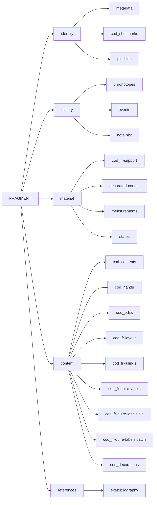

# Cadmus NDP FRAC

- [Cadmus models reference](https://myrmex.github.io/overview/cadmus/dev/models/)
- [Cadmus bricks playground](https://cadmus-bricks.fusi-soft.com/)
- [Cadmus NDP Books](https://github.com/vedph/cadmus-ndp-books)
- [Cadmus NDP Drawings](https://github.com/vedph/cadmus-ndp-drawings)

In what follows:

- 🟢 marks a [general](https://vedph.github.io/cadmus-doc/models/shared.html#general) or bibliographic part.
- 📖 marks a [codicology](https://vedph.github.io/cadmus-doc/models/shared.html#codicology) part.
- ⭐ marks a new part.

## New Parts

- [CodFrLayoutParts](docs/cod-fr-layout-part.md)
- [CodFrQuireLabelsPart](docs/cod-fr-quire-labels-part.md)
- [CodFrRulingsPart](docs/cod-fr-rulings-part.md)
- [CodFrSupportPart](docs/cod-fr-support-part.md)

## Item - Fragment

This item represents a single fragment.

- identity:

  - 🟢 [metadata part](https://github.com/vedph/cadmus-general/blob/master/docs/metadata.md)
  - 📖 [COD codicology shelfmarks part](https://github.com/vedph/cadmus-codicology/blob/master/docs/cod-shelfmarks.md)\*: either an existing shelfmark ID for the fragment, or a one created for it if the fragment has none (e.g.` Vat. lat. 13501 Fr.A` for a fragment in a manuscript with shelfmark `Vat. lat. 13501`).
  - 🟢 [pin links part](https://github.com/vedph/cadmus-general/blob/master/docs/pin-links.md): this links the fragment to its original container and current container. The different role of the link (original vs current) is defined by the link's tag. Each link can also include an assertion.

- history:

  - 🟢 [chronotopes part](https://github.com/vedph/cadmus-general/blob/master/docs/chronotopes.md)
  - 🟢 [historical events part](https://github.com/vedph/cadmus-general/blob/master/docs/historical-events.md)
  - 🟢 [note part](https://github.com/vedph/cadmus-general/blob/master/docs/note.md):`hist`
  - 🟢 [external bibliography part](https://github.com/vedph/cadmus-general/blob/master/docs/ext-bibliography.md)

- support:

  - ⭐ [CodFrSupportPart](docs/cod-fr-support-part.md)\*
  - 🟢 [decorated counts part](https://github.com/vedph/cadmus-general/blob/master/docs/decorated-counts.md)
  - 🟢 [physical measurements part](https://github.com/vedph/cadmus-general/blob/master/docs/physical-measurements.md)
  - 🟢 [physical states part](https://github.com/vedph/cadmus-general/blob/master/docs/physical-states.md)

- content:
  - ⭐ [CodFrLayoutPart](docs/cod-fr-layout-part.md)
  - 📖 [COD codicology contents part](https://github.com/vedph/cadmus-codicology/blob/master/docs/cod-contents.md)\*. A fragment typically includes a few verses, with optional lacunae in it. To represent this we can still use the codicology contents part, adding a content for each content covered by the fragment. So for instance if a fragment contains If.1,20-23 and If.1,25 (i.e. If 1.20-25 where 24 is missing) we just add 2 content entries for these two contents (optionally we can also use the tag to group these two contents together). Like any content entry each has its incipit, explicit etc.
  - 📖 [COD codicology hands part](https://github.com/vedph/cadmus-codicology/blob/master/docs/cod-hands.md)\*
  - 📖 [COD codicology edits part](https://github.com/vedph/cadmus-codicology/blob/master/docs/cod-edits.md)
  - ⭐ [CodFrRulingsPart](docs/cod-fr-rulings-part.md)\*
  - [links part](https://github.com/vedph/cadmus-general/blob/master/docs/fr.pin-links.md): links to the original/current container (a ms item). An _item flag_ will mark a reconstructed manuscript.
  - ⭐ [CodFrQuireLabelsPart](docs/cod-fr-quire-labels-part.md):`sig`: quire labels for signatures.
  - ⭐ [CodFrQuireLabelsPart](docs/cod-fr-quire-labels-part.md):`catch`: quire labels for catchwords.
  - 📖 [COD CodDecorationsPart](https://github.com/vedph/cadmus-codicology/blob/master/docs/cod-decorations.md)

> The codicological formula targets size and text area (D. Bianconi, P. Orsini). See the [CodLayoutView](https://github.com/vedph/cod-layout-view) library for it.

Fragments are usually contained in manuscripts, so fragments references will target them in the codicological section of the database.

## History

### 0.0.14

- 2025-10-14: updated docs and removed legacy code from support part.

### 0.0.13

- 2025-10-08: updated packages.

### 0.0.12

- 2025-09-16: updated packages.

### 0.0.11

- 2025-08-14: added features to `CodFrLayoutPart`.

### 0.0.10

- 2025-08-07: updated packages.

### 0.0.9

- 2025-07-16: updated packages.
- 2025-07-14: updated packages.
- 2025-07-08: fixed seeder tag.

### 0.0.6

- 2025-07-03: added `CodFrLayoutPart` extracting its data from `CodFrSupportPart`.
- 2025-06-29: renamed support `preservationPlace` to `container` to properly reflect its meaning.
- 2025-06-22: more data and thesauri in seeders.

### 0.0.3

- 2025-06-21: use `AssertedCompositeId` for `handId` in `CodFrQuireLabelsPart`.

### 0.0.2

- 2025-06-16: minor refinements in models.
