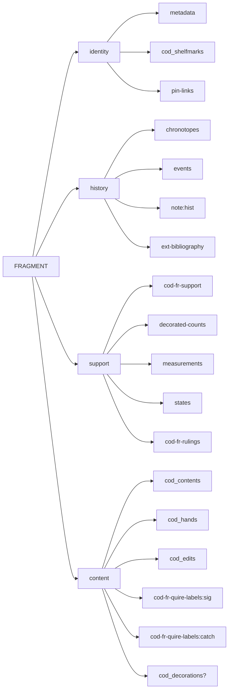
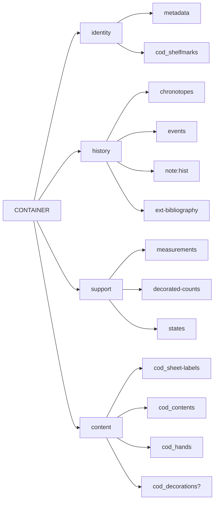

# Cadmus NDP FRAC

- [Cadmus models reference](https://myrmex.github.io/overview/cadmus/dev/models/)
- [Cadmus bricks playground](https://cadmus-bricks.fusi-soft.com/)
- [Cadmus NDP Books](https://github.com/vedph/cadmus-ndp-books)
- [Cadmus NDP Drawings](https://github.com/vedph/cadmus-ndp-drawings)

In what follows:

- 🟢 marks a [general](https://vedph.github.io/cadmus-doc/models/shared.html#general) or bibliographic part.
- 📖 marks a [codicology](https://vedph.github.io/cadmus-doc/models/shared.html#codicology) part.
- ⭐ marks a new part. The star is used once, even when that part is then reused in other items. If a part marked with a star has a link to documentation, this means that I have already implemented it as I could do this in advance for generic parts. All the other parts are still to be implemented.
- ⚠️ marks an area where the model must still be defined with a discussion.

## New Parts

### CodFrQuireLabelsPart

Codicological fragments quire labels for signatures.

- ⭐ `CodFrQuireLabelsPart`:
  - labels (`QuireLabel[]`):
    - `types` (`string[]`, 📚 `cod-fr-quire-label-types`: flags like alfabeto latino, greco, cifre arabe, romane, decorato, altro; hidden if no such thesaurus).
    - `text` (`string`)
    - `positions`\* (`string[]`, 📚 `cod-fr-quire-label-positions`: flags like margine inferiore, margine superiore, centro, angolo interno, angolo esterno, colonna A, colonna B).
    - `hand` (`string`; lookup?)
    - `ink` (`string`, free text)
    - `note` (`string`, free text)

### CodFrRulingsPart

Codicological fragment rulings.

- ⭐ `CodFrRulingsPart`:
  - rulings (`CodFrRulings[]`):
    - features (`string[]` 📚 `cod-fr-ruling-features`, flags like a secco, a mina, a inchiostro, a colore, piegatura, altro, non individuabile).
    - system (`string`, 📚 `cod-fr-ruling-system`)
    - type (`string`, 📚 `cod-fr-ruling-types`)
    - note (`string`)

### CodFrSupportPart

Codicological fragment support.

- ⭐ `CodFrSupportPart`:
  - `material` (`string`, 📚 `cod-fr-support-materials`)
  - `location` (`string`): a location relative to an ideal rectangular grid overlaid on top of the surface of the object the fragment belonged to. The location is expressed as a set of coordinates, see <https://cadmus-bricks.fusi-soft.com/mat/physical-grid> for a demo.
  - `pricking` (`boolean`)
  - `layout` formula (`string`, ⚠️ codicology-like to be defined according to D. Bianconi, _I Codices Graeci Antiquiores tra scavo e biblioteca_, in _Greek Manuscript Cataloguing: Past, Present, and Future_, edited by P. Degni, P. Eleuteri, M. Maniaci, Turnhout, Brepols, 2018 (Bibliologia, 48), 99-135, especially 110-111).
  - `reuse` type (`string`, 📚 `cod-fr-support-reuse-types`)
  - `supposedReuse` type (`string`, 📚 `cod-fr-support-reuse-types`)
  - `preservationPlace` (`string`, 📚 `cod-fr-support-places`)

## Item - Fragment

This item represents a single fragment.

- identity:
  - 🟢 [metadata part](https://github.com/vedph/cadmus-general/blob/master/docs/metadata.md)
  - 📖 [COD codicology shelfmarks part](https://github.com/vedph/cadmus-codicology/blob/master/docs/cod-shelfmarks.md) ❓what is this used for? If this belongs to the container, it has no use here. If instead it refers to the fragment itself, it belongs here as its ID.
  - 🟢 [pin links part](https://github.com/vedph/cadmus-general/blob/master/docs/pin-links.md): this links the fragment to its original container and current container. The different role of the link (original vs current) is defined by the link's tag. Each link can also include an assertion.

- history:
  - 🟢 [chronotopes part](https://github.com/vedph/cadmus-general/blob/master/docs/chronotopes.md)
  - 🟢 [historical events part](https://github.com/vedph/cadmus-general/blob/master/docs/historical-events.md)
  - 🟢 [note part](https://github.com/vedph/cadmus-general/blob/master/docs/note.md):`hist`
  - 🟢 [external bibliography part](https://github.com/vedph/cadmus-general/blob/master/docs/ext-bibliography.md)

- support:
  - ⭐ [CodFrSupportPart](#codfrsupportpart)
  - 🟢 [decorated counts part](https://github.com/vedph/cadmus-general/blob/master/docs/decorated-counts.md)
  - 🟢 [physical measurements part](https://github.com/vedph/cadmus-general/blob/master/docs/physical-measurements.md)
  - 🟢 [physical states part](https://github.com/vedph/cadmus-general/blob/master/docs/physical-states.md)
  - ⭐ [CodFrRulingsPart](#codfrrulingspart)
  - [links part](https://github.com/vedph/cadmus-general/blob/master/docs/fr.pin-links.md): links to the original/current container (a ms item). An _item flag_ will mark a reconstructed manuscript.

- content:
  - 📖 [COD codicology contents part](https://github.com/vedph/cadmus-codicology/blob/master/docs/cod-contents.md). A fragment typically includes a few verses, with optional lacunae in it. To represent this we can still use the codicology contents part, adding a content for each content covered by the fragment. So for instance if a fragment contains If.1,20-23 and If.1,25 (i.e. If 1.20-25 where 24 is missing) we just add 2 content entries for these two contents (optionally we can also use the tag to group these two contents together). Like any content entry each has its incipit, explicit etc. ⚠️ Determine if other properties are required.
  - 📖 [COD codicology hands part](https://github.com/vedph/cadmus-codicology/blob/master/docs/cod-hands.md)
  - 📖 [COD codicology edits part](https://github.com/vedph/cadmus-codicology/blob/master/docs/cod-edits.md)
  - ⭐ [CodFrQuireLabelsPart](#codfrquirelabelspart):`sig`: quire labels for signatures.
  - ⭐ [CodFrQuireLabelsPart](#codfrquirelabelspart):`catch`: quire labels for catchwords.
  - 📖 [COD CodDecorationsPart](https://github.com/vedph/cadmus-codicology/blob/master/docs/cod-decorations.md)

>The codicological formula targets size and mirror (D. Bianconi, P. Orsini). See the [CodLayoutView](https://github.com/vedph/cod-layout-view) library for it.

The container of a fragment, whether it's the current one or the original one, is a manuscript item linked from the fragment. Originally we were thinking about these parts:

- identity:
  - 🟢 [metadata part](https://github.com/vedph/cadmus-general/blob/master/docs/metadata.md)
  - 📖 [COD codicology shelfmarks part](https://github.com/vedph/cadmus-codicology/blob/master/docs/cod-shelfmarks.md)

- history:
  - 🟢 [chronotopes part](https://github.com/vedph/cadmus-general/blob/master/docs/chronotopes.md)
  - 🟢 [historical events part](https://github.com/vedph/cadmus-general/blob/master/docs/historical-events.md)
  - 🟢 [note part](https://github.com/vedph/cadmus-general/blob/master/docs/note.md):`hist`
  - 🟢 [external bibliography part](https://github.com/vedph/cadmus-general/blob/master/docs/ext-bibliography.md)

- support:
  - 🟢 [physical measurements part](https://github.com/vedph/cadmus-general/blob/master/docs/physical-measurements.md)
  - 🟢 [decorated counts part](https://github.com/vedph/cadmus-general/blob/master/docs/decorated-counts.md)
  - 🟢 [physical states part](https://github.com/vedph/cadmus-general/blob/master/docs/physical-states.md)

- content:
  - 📖 [COD codicology sheet labels part](https://github.com/vedph/cadmus-codicology/blob/master/docs/cod-sheet-labels.md)
  - 📖 [COD codicology contents part](https://github.com/vedph/cadmus-codicology/blob/master/docs/cod-contents.md)
  - 📖 [COD codicology hands part](https://github.com/vedph/cadmus-codicology/blob/master/docs/cod-hands.md)
  - 📖 [COD CodDecorationsPart](https://github.com/vedph/cadmus-codicology/blob/master/docs/cod-decorations.md)

❓ TODO: this is going to merge with fr quire labels part above?:

- ⭐ fragment container description:
  - `material` (`string`, 📚 )
  - `formula` (`string`, Codicology-like) if the ms is present
  - `virtualQuires` (`VirtualQuire[]`):
    - `sheetCount` (`short`)
    - `ordinal` (`short`, negative or positive; negative is a reverse ordinal)
    - `numbering` (`string`)
